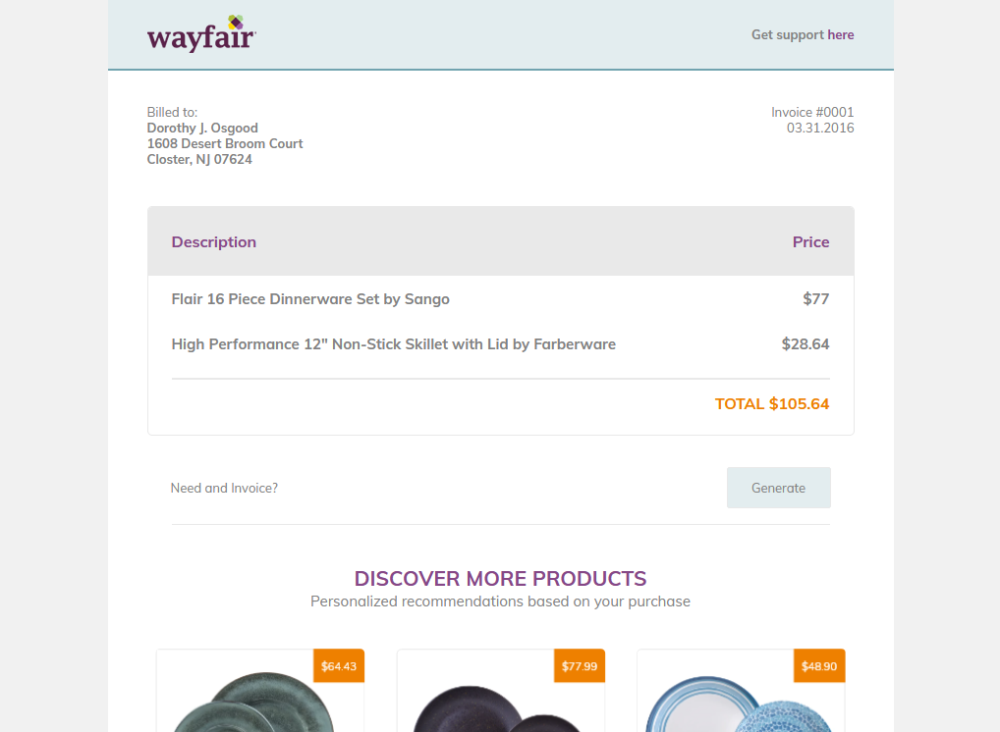

# Wayfair Product Order Invoice Email

Design-to-code responsive html email using a design from the site [UI Design Daily](https://www.uidesigndaily.com).

---

This project uses the [MJML](https://mjml.io) pre-processing markup language.

## Observations

This is the second project covering an email, and the first to explore the use of the `MJML` pre-processing markup.

Based on the provided markup, the images with pricing under "Discover More Products" were not given as a single image, so I had to recreating the masking to export all the layers in each group (including the grey rounded border) as a single image as email clients are not too consistent with handling background images with an off-positioned small piece of text, and most marketing emails with pricing usually provide images that include the price instead of layering.

This design is also given a desktop layout, so with the power of `MJML`, I was able to ensure it became responsive for any device, and was not concerned with needing more control of vanill HTML markup. Some sections didn't need to go from two columns to one (i.e the Details of the products purchased), so the `mj-group` component came in handy.

_This email was able to be tested with Gmail in Firefox, Gmail for Android, Outlook for Windows_
